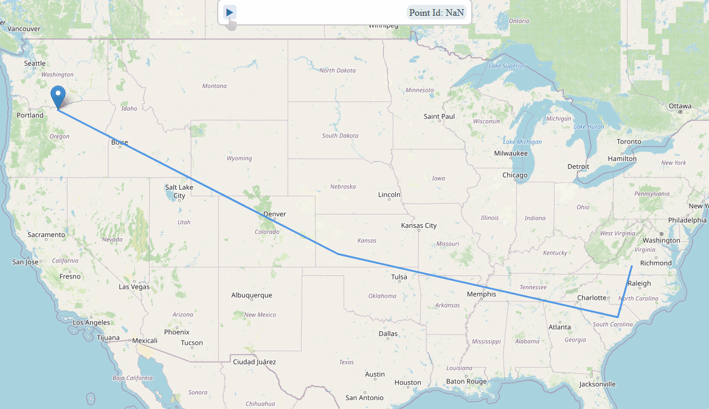

# Leaflet.MarkerPlayer
A Leaflet plug-in for animating marker with ability to set progress!


## Live Deme
[🔗 Simple realworld use example](https://0n3byt3.github.io/)

## Compatibility with Leaflet Versions
compatible and tested with the latest stable Leaflet version `leaflet-1.9.2`.
(not tested with old versions)

## Browser CompatibilityBrowser Compatibility
This plugin internally uses `window.requestAnimationFrame` through the Leaflet function `L.Util.requestAnimFrame`

## Features
* Animate your marker along a polyline.
* You can zoom in/out, your moving marker will be at the right place !
* You can pause or end the animation whenever you want.
* You can set/get progress whenever you want.
* You can deal with events.
* You can make **loop**.
* You can add the point one by one.
* You can add *station* at some points of the polyline.

## Usage
Include the plugin JS file on your page after Leaflet files, using your method of choice:
* Download the code
* Use unpkg CDN: `https://unpkg.com/leaflet.markerplayer`
* Install with npm: `npm install leaflet.markerplayer`

In each case, use files in the dist folder.

Then add your first MarkerPlayer:

```javascript
let myMarkerPlayer = L.markerPlayer([
    {
        latlng: [48.8567, 2.3508]
    },
    {
        latlng: [48.8567, 2.3508]
    }
], 30000).addTo(map);
//...
myMarkerPlayer.start();
```

## API

**Factory**
```
L.markerPlayer(<Point[]> points, <Number | Number[]> duration [,<Object> options]);
```
**points**:
*   array of Objects with `latlng` property

**Note**: As Leaftlet's other functions, it also accept `latlng` property in a simple Array form and simple object form ([see Leaflet docs](http://leafletjs.com/reference.html#latlng)).

**durations**:
*   if number : total duration (autocalculate duration in ms per line segment proportionnaly to distance between points).
*   if array of number : duration in ms per line segment.


**Options**
All the Leaflet marker's options are available plus:

 - `autostart`: if `true` the marker will start automatically after it is added to map. Default: `false`

 - `loop`: if `true` the marker will start automatically at the beginning of the polyline when the it arrives at the end. Default: `false`


**Methods**

*Getter*

 - `isRunning()`: return `true` if the marker is currently moving.
 - `isPaused()`: return `true` if the marker is paused

 - ` isEnded()`: return `true` if the marker is arrived to the last position or it has been stopped manually

 - `isStarted()`: return `true` if the marker has started
 - `getProgress(<Boolean> timeFormat = false)`: return animation progress in percentage by default or in case `timeFormat = true` the elapsed time(ms) relative to the total animation `duration` value.

**Note**: ```Marker.getLatLng()``` still works and give the current position

*Setter*

 - `start()`:  the marker begins its path or resumes if it is paused.

 - ` stop()`: manually stops the marker, if you call `start` after, the marker starts again the polyline at the beginning.

 - `pause()`: just pauses the marker

 - `resume()`: the marker resumes its animation

 - `addPoint(<Point> point, <Number> duration)`: adds a point to the polyline. Useful, if we have to set the path one by one.

 - ` moveTo(<Point> point, <Number> duration)`: stops current animation and make the marker move to `point` in `duration` ms.

 - `addStation(<Number> pointIndex, <Number> duration)`: the marker will stop at the `pointIndex`th points of the polyline during `duration` ms. You can't add a station at the first or last point of the polyline.

 - ` setProgress(<Number> percentage)`: set animation progress in percentage.

*Events*

 - `start`: fired when the animation starts.
 - ` end`: fired when the animation stops; passes `progress` value to  event data.
 - `loop`: fired when the animation begin a new loop; passes `progress` value to  event data.
 - `pointchange`: fired when the animation point changes; passes the new `point` value to  event data.
 - `progresschange`: fired when the animation progress changes; passes `progress` value to  event data.

**Note**: Event are not synchrone because of the use of ```requestAnimationFrame```.  If you quit the tab where the animation is working, events will be fired when the tab will get back the focus.

## How it works
This plugin internally uses ``` window.requestAnimationFrame``` through the Leaflet function ```L.Util.requestAnimFrame```. When the browser need to repaint, the marker interpolate linearly its position thanks to the elapsed time.

**Why do you just not use transitions ?**

If your marker moves very slowly (1-2 min or more for one transition) and you zoom in, your marker will be at the wrong place and take a lot of time to be where it has to be. Moreover, you have to do some hacks to get the current position of the marker during the animation.


## ✨Future Features
 - accepting latlng array as points

## ✌ Support
 - BTC: 1BjLHVV1A4VxK1eACAUsMFDrWza71iwV9p
 - ETH: 0xEa21E67BF5Ec26bb7Cf2ddB64538e908b086F1D5
 

## License
MIT License
